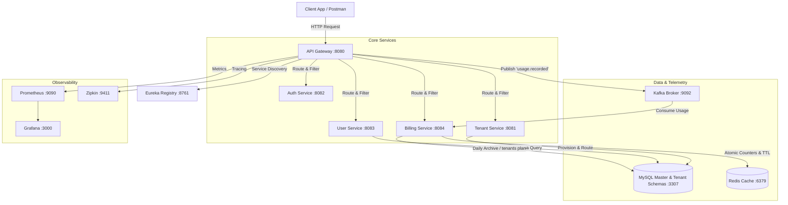

# Saasify: Multi-Tenant Schema-Isolated Microservices Framework

Saasify is a production-grade, highly scalable SaaS (Software-as-a-Service) boilerplate framework built with **Spring Boot**, **Spring Cloud**, **Apache Kafka**, **Redis**, and **MySQL**. It implements a **Schema-per-Tenant** architecture, providing absolute data isolation between different customer accounts (tenants) while utilizing shared computing resources.

---

## 🏗️ Architecture & Data Isolation Flow

The framework employs a dynamic database routing mechanism. Each tenant's data is housed in a separate, isolated schema inside MySQL, dynamically provisioned at registration. 



### Key Architectural Pillars:
1. **Schema-per-Tenant Isolation**: Customers (tenants) dynamically resolve to their own dedicated database schema based on the `X-Tenant-ID` HTTP header or Host subdomain.
2. **Elastic Tenant Provisioning**: Onboarding a new tenant automatically runs DDL migration scripts (via Flyway) to generate a isolated database schema instantly without server restart.
3. **Decoupled Asynchronous Telemetry**: API Gateways track user request counts and dispatch them to Apache Kafka. The Billing Service consumes these events asynchronously, maintaining high throughput.
4. **Gateway-Level JWT Guardrails**: Centralized security filters validate tokens and block cross-tenant hijacking attempts.
5. **Gateway-Level Auto-Suspension**: Instantly blocks API access for `SUSPENDED` tenants returning `402 Payment Required`, with dynamic cache-refill fallbacks.
6. **Telemetry Resiliency (Kafka DLQ & Retry)**: Consumed telemetry events are automatically retried 4 times with exponential backoff, routing persistent failures to a Dead Letter Queue (DLQ) for monitoring.
7. **Fault-Tolerant Inter-Service Communication (Resilience4j)**: OpenFeign clients are protected with **Resilience4j Circuit Breaker & Retry** policies with graceful fallbacks (e.g., fallback plan thresholds) to prevent cascading failures if critical services go offline.
8. **Distributed Context Correlation (MDC Logging)**: Propagates correlation, tenant, and user IDs across thread pools and network hops using custom servlet and reactive filters to ensure uniform, end-to-end log correlation.
9. **Gateway Token-Bucket Rate Limiting**: Protects downstream services from denial-of-service surges by implementing per-tenant, per-minute rate-limiting directly inside the Gateway via reactive Redis scripts.

---

## 🛠️ Technology Stack

| Component | Technology | Description |
| :--- | :--- | :--- |
| **Core Framework** | Java 17+, Spring Boot 3.x | Back-end microservices runtime. |
| **Gateway & Discovery** | Spring Cloud Gateway, Netflix Eureka | Central registry and intelligent request routing. |
| **Database** | MySQL 8.0, Flyway | Multitenant database storage with schema migrations. |
| **Telemetry Cache** | Redis 7.0 (Alpine) | Daily rate-limiting counters & distributed caches. |
| **Event Broker** | Apache Kafka 3.x (Confluent) | High-throughput asynchronous message pipeline. |
| **Observability** | Prometheus, Grafana, OpenTelemetry, Zipkin | Distributed tracing, performance tracking, and dashboards. |

---

## ⚙️ Prerequisites

Before running the application, make sure you have the following installed:
* [Java Development Kit (JDK) 17 or 23](https://adoptium.net/)
* [Apache Maven 3.8+](https://maven.apache.org/)
* [Docker Desktop](https://www.docker.com/products/docker-desktop/)

---

## 🚀 Getting Started

### 1. Launch Docker Infrastructure
Start the database, caching layer, event broker, and tracing components:
```bash
docker compose up -d
```
Verify all containers are up and healthy:
```bash
docker ps
```

### 2. Build the Microservices
Build and package all multi-module Maven projects (skipping tests for quick startup):
```bash
mvn clean install -Dmaven.test.skip=true
```

### 3. Start the Services
Use the bundled Windows batch script to launch the application:
```cmd
run-services.bat
```
*(When prompted to rebuild, type `n` if you have already run the Maven compile command above).*

The services will spin up in the following order:
* **Eureka Registry Server** (Port `8761`)
* **API Gateway** (Port `8080`)
* **Tenant Service** (Port `8081`)
* **Auth Service** (Port `8082`)
* **User Service** (Port `8083`)
* **Billing Service** (Port `8084`)

---

## 🧪 Postman Testing Walkthrough

Import the collection found inside `postman/Saasify Platform API E2E.postman_collection.json` into Postman.

### Step 1: Onboard a New Tenant
* **Endpoint**: `POST http://localhost:8080/api/tenants`
* **Request Payload**:
  ```json
  {
    "name": "Acme Corporation",
    "subdomain": "acme",
    "contactEmail": "admin@acme.com",
    "plan": "FREE"
  }
  ```
* **What happens**: The system creates a new entry in `saasify_master.tenants`, creates a dedicated database schema `tenant_acme`, and runs the user tables migration automatically.

### Step 2: Register a Tenant User
* **Endpoint**: `POST http://localhost:8080/api/auth/register`
* **Header**: `X-Tenant-ID: acme`
* **Request Payload**:
  ```json
  {
    "email": "employee@acme.com",
    "password": "Password123!",
    "role": "MEMBER"
  }
  ```
* **Duplicate Protection**: If this email is already registered under this tenant, the system returns `409 Conflict` with: `"You have already registered. Please try to log in."`.

### Step 3: Login to Obtain JWT Token
* **Endpoint**: `POST http://localhost:8080/api/auth/login`
* **Header**: `X-Tenant-ID: acme`
* **Request Payload**:
  ```json
  {
    "email": "employee@acme.com",
    "password": "Password123!"
  }
  ```
* **What happens**: Copies the returned `accessToken` JWT to use in subsequent requests.

### Step 4: Access User Services (Protected)
* **Endpoint**: `GET http://localhost:8080/api/users`
* **Headers**:
  * `Authorization`: `Bearer <paste_your_accessToken>`
  * `X-Tenant-ID`: `acme`

### Step 5: Billing & Usage Tracking
Make multiple API calls as the user, then query metrics:
1. **Get Today's Usage**: 
   * `GET http://localhost:8080/api/billing/usage/acme`
   * Returns live real-time API request counters queried from Redis.
2. **Trigger Archival (Simulates Daily Cron)**:
   * `POST http://localhost:8080/api/billing/usage/trigger-archive` (Protected endpoint - requires auth headers).
   * Moves yesterday's Redis telemetry counters to permanent database history.
3. **Get Usage History**:
   * `GET http://localhost:8080/api/billing/usage/acme/history`
   * Queries the database history catalog using the tenant's mapped UUID.

### Step 6: Suspend a Tenant & Verify Auto-Blocking
1. **Suspend the Tenant**:
   * Send a `PUT` request to update status:
     `PUT http://localhost:8080/api/tenants/<tenant-uuid>/status?status=SUSPENDED`
2. **Verify API Block**:
   * Try calling `GET http://localhost:8080/api/users` again with headers.
   * **Expected Response**: The API Gateway immediately blocks the request with `402 Payment Required` and payload:
     ```json
     {
       "error": "Payment Required",
       "message": "Tenant account is suspended. Please resolve billing issues or upgrade plan."
     }
     ```
3. **Re-activate the Tenant**:
   * Restore service by sending a `PUT` request:
     `PUT http://localhost:8080/api/tenants/<tenant-uuid>/status?status=ACTIVE`
   * Subsequent API requests will instantly succeed again.

---

## 🛡️ Fault Tolerance & Resiliency Walkthrough

The project implements defensive programming patterns to remain resilient during infrastructure degradation:

### 1. Kafka Telemetry Retry & DLQ (Billing Service)
* **What it does**: If the Billing Service loses its connection to MySQL or Redis while processing usage counters, it will fail to resolve the tenant's plan. Rather than dropping the telemetry silently, it throws an exception to trigger the Kafka retry loop.
* **How to Verify**:
  1. Temporarily stop the MySQL container:
     ```bash
     docker stop saasify-mysql
     ```
  2. Make an API call through the gateway. The gateway logs the request and publishes `"acme"` to the `usage.recorded` Kafka topic.
  3. Inspect the **Billing Service console logs**. You will see the consumer attempting to process the message 4 times (1 initial + 3 retries) with exponential backoff delays (2s -> 4s -> 8s).
  4. Once all 4 attempts fail, the message is routed to the Dead Letter Queue (`usage.recorded.DLQ`), printing a `CRITICAL` log warning.
  5. Restart the database: `docker start saasify-mysql`.

### 2. Resilience4j Circuit Breaker & Retry (User Service)
* **What it does**: When registering a new user, `user-service` makes a Feign request to `tenant-service` to check the database limits. If `tenant-service` is down, a Resilience4j Circuit Breaker intercepts the call and falls back gracefully to default `FREE` tier rules, preventing a generic `500 Server Error`.
* **How to Verify**:
  1. Stop the `tenant-service` process.
  2. Send a request to register a new user:
     `POST http://localhost:8080/api/auth/register` (with headers and registration body).
  3. Inspect the **User Service logs**. You will see:
     ```text
     Warning: tenant-service is down. Falling back to default plan limits.
     ```
  4. The request completes successfully using the safe fallback thresholds rather than breaking the user registration flow.

---

## 📊 Observability & Monitoring Dashboards

The infrastructure includes complete distributed tracing and metrics aggregation configured out-of-the-box. After making some API calls, you can inspect the telemetry across these dashboards:

### 1. Distributed Tracing (Zipkin)
* **Dashboard URL**: [http://localhost:9411/zipkin/](http://localhost:9411/zipkin/)
* **How to Verify**:
  1. Click **Run Query** in the top right to view trace logs for recent HTTP transactions.
  2. Click on the cascade timeline for `GET /api/users` to see tracing spans propagated dynamically from the `api-gateway` down to `user-service` under the same W3C `traceId`.
  3. Click any span, look under **Tags**, and verify that the custom attribute `tenant.id` matches the active tenant (e.g., `acme`).
  4. Search `tenant.id=acme` in the search bar to filter tracing profiles by tenant context.

### 2. Metrics Collection (Prometheus)
* **Dashboard URL**: [http://localhost:9090/](http://localhost:9090/)
* **How to Verify**:
  1. Navigate to **Status > Targets** to verify all microservices are registered as scraped endpoints.
  2. Go to the **Graph** tab, execute a query for the custom metric `tenant_api_requests_total`, and verify it shows data points tagged with labels like `{tenant_id="acme", status="200"}`.

### 3. Monitoring & Dashboards (Grafana)
* **Dashboard URL**: [http://localhost:3000/](http://localhost:3000/) *(Bypasses login automatically as Admin)*
* **How to Verify**:
  1. Add a **Prometheus** datasource pointing to URL `http://prometheus:9090`.
  2. Create metrics panels using PromQL queries matching template parameters like `sum(rate(tenant_api_requests_total{tenant_id="$tenant"}[1m]))`.
  3. Use the `$tenant` dashboard variables dropdown to filter metrics panels by specific tenant subdomains dynamically.

---

## 📤 Publishing to GitHub

To publish this project to your own GitHub repository, execute the following commands in the project's root folder:

### 1. Initialize Git Repository
```bash
git init
```

### 2. Configure Git Exclusions (`.gitignore`)
Ensure compiled files and target directories are ignored. A standard `.gitignore` is already set up in the workspace.

### 3. Stage and Commit Files
```bash
git add .
git commit -m "Initial commit: Saasify Multitenant Microservices Boilerplate"
```

### 4. Create a New Repository on GitHub
1. Go to your [GitHub Account](https://github.com/) and click **New Repository**.
2. Name it `saasify` (or choose another name).
3. Do **not** check "Initialize this repository with a README", "Add .gitignore", or "Choose a license" (as they are already present locally).
4. Click **Create repository**.

### 5. Link Local Repository and Push
Copy the commands from the GitHub quick setup page:
```bash
# Rename the default branch to main
git branch -M main

# Link your local repo to the remote repository (Replace with your actual GitHub URL)
git remote add origin https://github.com/YOUR_GITHUB_USERNAME/saasify.git

# Push to the main branch
git push -u origin main
```
